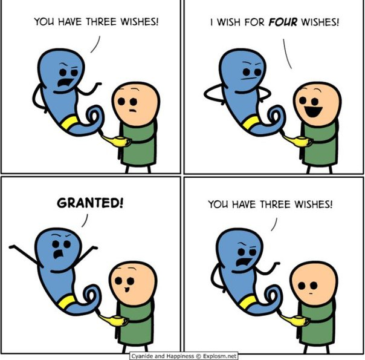

# RECURSION

<p>
    
</p>

## Brief Summary
**Recursive Function** - This is a function that calls itself
Recursion is a cleaner alternative to iteration 
Recursive functions keep pushing themselves onto the call stack over and over again until it encounters the base case

**Base Case** - This is the condition which indicates the end of recursion

**Call Stack** - Anytime a function is called/invoked it is placed(pushed) on top of the call stack. When the function finishes executing and has returned a value then it is removed(poped) from the call stack.

**StackOverflow** - This error occurs when you exceed the maximum call stack size

**Helper Method Recursion** - This is when we have a recursive function inside a non-recursive function

on every iteration the recursive function takes in a **Different Input**

## Where things go wrong in recursion

    1. No base case

    2. Forgeting to return or returning the wrong value

## Directory Structure

```
.
├── arrproduct
│   ├── arrproduct.js
│   └── arrproduct.py
├── capitalize
│   ├── capitalize.js
│   └── capitalize.py
├── collectodds
│   ├── collectodds.js
│   ├── collectodds.py
│   ├── collectodds_v2.js
│   └── collectodds_v2.py
├── countdown
│   ├── countdown.js
│   └── countdown.py
├── factorial
│   ├── factorial.js
│   └── factorial.py
├── fibb
│   ├── fibb.js
│   └── fibb.py
├── fizzbuzz
│   ├── fizzbuzz.js
│   └── fizzbuzz.py
├── power
│   ├── power.js
│   └── power.py
├── README.md
└── sumrange
    ├── sumrange.js
    └── sumrange.py

9 directories, 21 files

```

